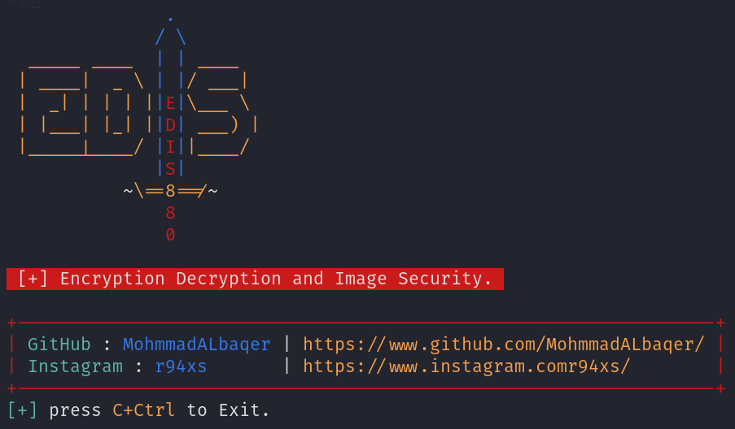

### What is a tool EDIS?
```
It is an abbreviation for the word (Encryption Decryption and Image Security). The tool encrypts an image in any format (JPG) or (PNG) and then converts it to an audio file that is also encrypted and incomprehensible. It can also decrypt the sound and return the image to what it was.
```
###Screenshot



### Installation (Linux)
```
$ git clone https://github.com/MohmmadALbaqer/EDIS.git
$ cd EDIS
$ pip3 install -r requirements.txt
$ python3 install.py
$ bash install.sh
$ sudo python3 EDIS.py
# OR
$ python3 EDISC.py
```

### UPDATE Tool 
```
$ python3 update.py
```

## [~] Find Me on :

- [](https://github.com/MohmmadALbaqer)


- [](https://instagram.com/r94xs)

